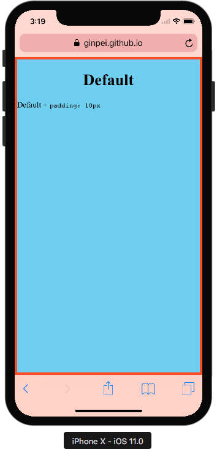
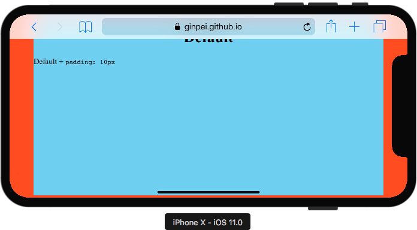
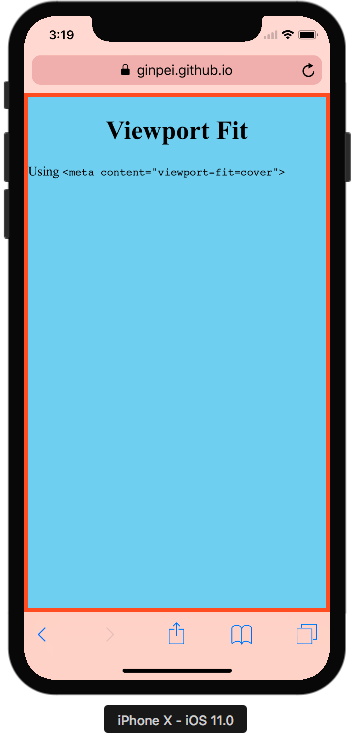
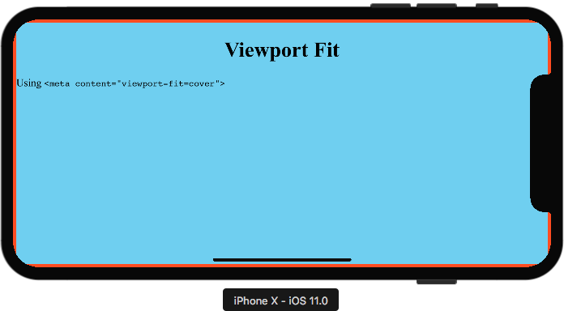
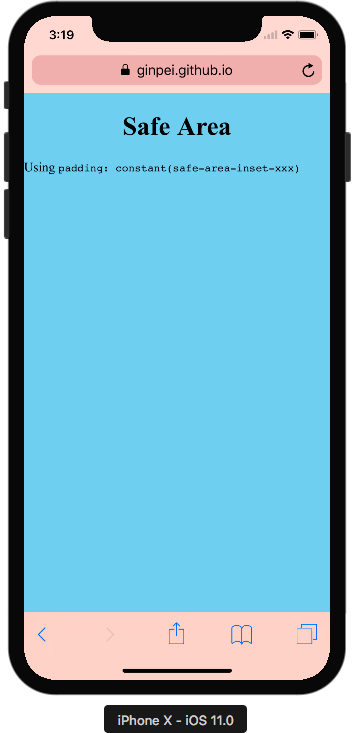

# iPhone X - Safe Area Demo

- [https://ginpei.github.io/iPhoneX-safe-area-demo/](https://ginpei.github.io/iPhoneX-safe-area-demo/)

# Screenshots

`<body>` is red, `<div>` under `<body>` is blue.

## Default + `padding: 5px`





## Viewport Fit

```html
<meta name="viewport" content="width=device-width, initial-scale=1.0, viewport-fit=cover" />
```





## Safe Area

```css
body {
  padding:
    constant(safe-area-inset-top)
    constant(safe-area-inset-right)
    constant(safe-area-inset-bottom)
    constant(safe-area-inset-left);
}
```




